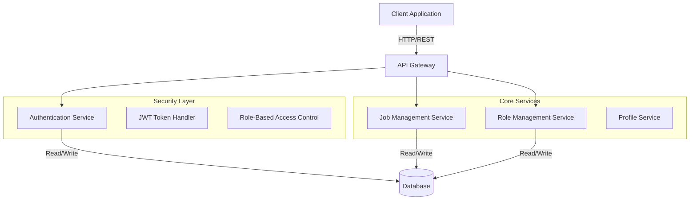
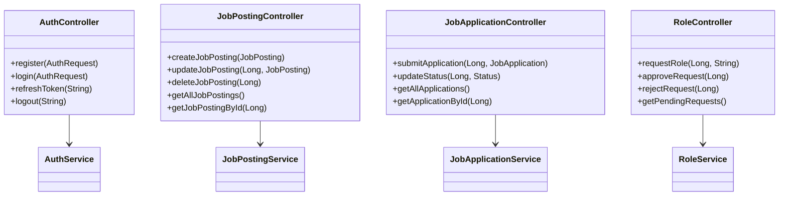
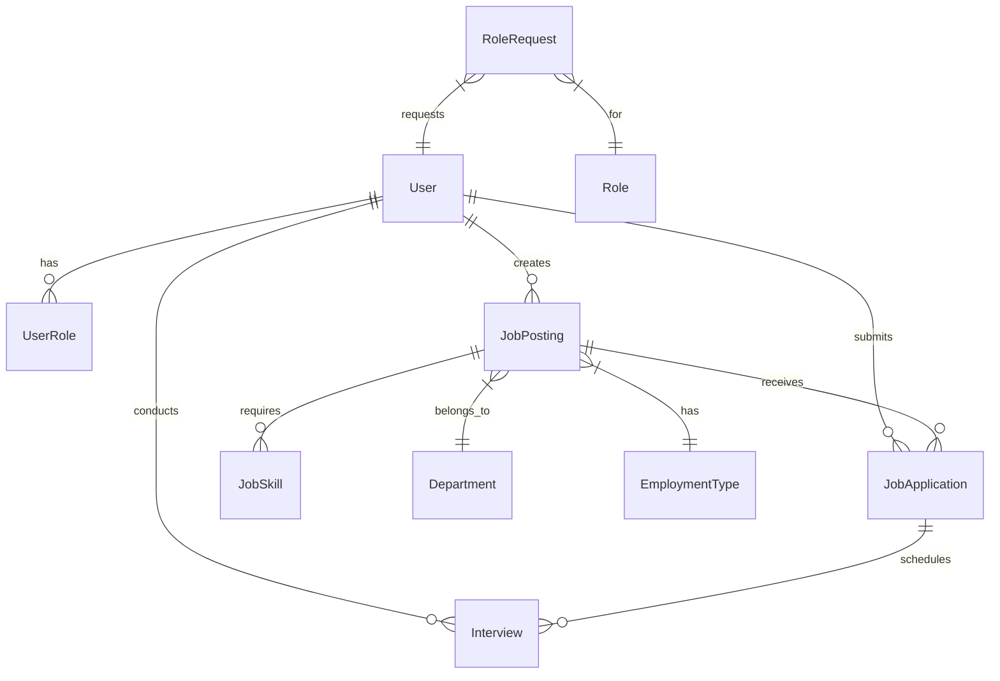
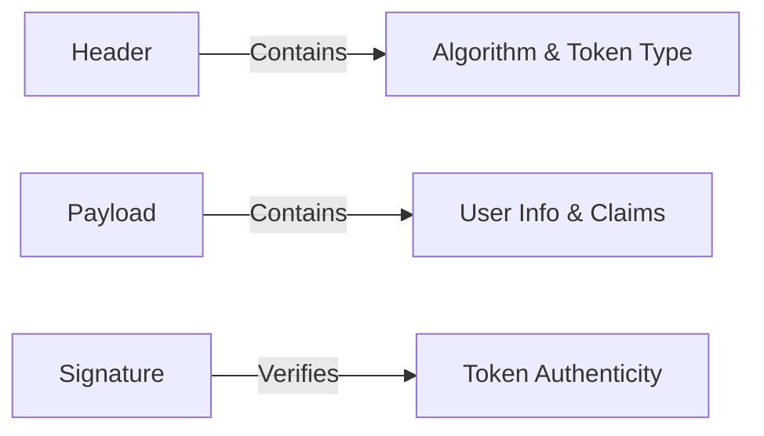
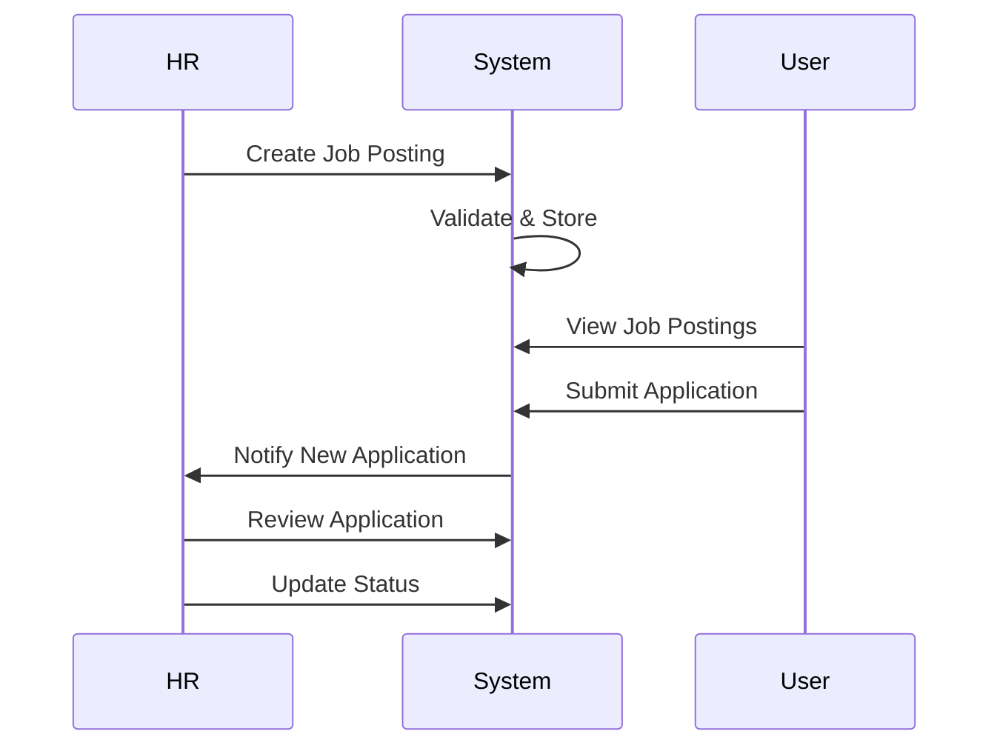
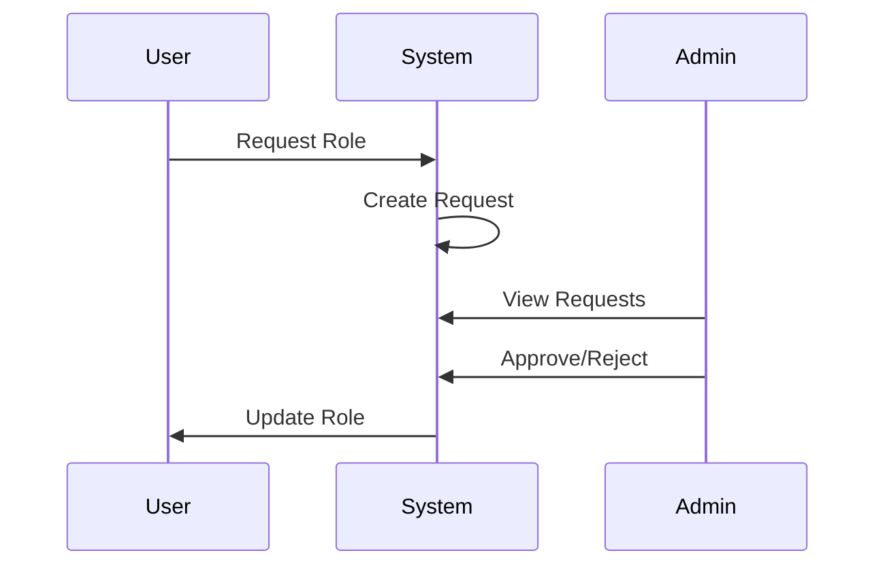

# HR Management System Extension

## Overview
The HR Management System is an extension of the Profile Builder application that adds comprehensive job posting, application tracking, and interview management capabilities. It enables HR users to manage job openings, track applications, and coordinate interviews efficiently.

## System Architecture

### High-Level Architecture


### Component Architecture


## Database Schema


## API Endpoints

### Authentication
```
POST   /api/auth/register         - Register new user
POST   /api/auth/login           - User login
POST   /api/auth/refresh         - Refresh access token
POST   /api/auth/logout          - User logout
```

### Role Management
```
POST   /api/roles/request        - Request role change
GET    /api/roles/requests       - List pending requests (admin)
PUT    /api/roles/requests/{id}/approve  - Approve request
PUT    /api/roles/requests/{id}/reject   - Reject request
GET    /api/roles/my-requests    - View own requests
```

### Job Management
```
POST   /api/job-postings         - Create job posting
GET    /api/job-postings         - List all postings
GET    /api/job-postings/{id}    - Get posting details
PUT    /api/job-postings/{id}    - Update posting
DELETE /api/job-postings/{id}    - Delete posting
```

### Application Management
```
POST   /api/job-applications/jobs/{id}/apply  - Submit application
GET    /api/job-applications     - List applications
GET    /api/job-applications/{id} - Get application
PUT    /api/job-applications/{id}/status - Update status
```

## Authentication & Authorization

### JWT Token Structure


### Role-Based Access Control
- ROLE_USER: Basic access, can apply for jobs
- ROLE_HR: Job posting management
- ROLE_ADMIN: Full system access

## Key Workflows

### Job Posting Workflow


### Role Request Workflow


## Security Implementation

- JWT-based authentication
- Role-based access control
- Token blacklisting
- Request validation
- Error handling
- Audit logging

## Testing Strategy

1. Unit Tests
   - Service layer testing
   - Repository layer testing
   - Controller layer testing

2. Integration Tests
   - End-to-end flow testing
   - API endpoint testing
   - Database integration testing

## Deployment

1. Build the application:
   ```bash
   ./mvnw clean package
   ```

2. Run the application:
   ```bash
   java -jar target/profile-0.0.1-SNAPSHOT.jar
   ```

3. Docker deployment:
   ```bash
   # Build the Docker image (uses Java 17)
   docker build -t hr-management-system .

   # Run the container
   docker run -p 8080:8080 hr-management-system
   ```

   Dockerfile:
   ```dockerfile
   # Use official OpenJDK 17 image as base
   FROM openjdk:17-slim

   # Set working directory
   WORKDIR /app

   # Copy the JAR file
   COPY target/profile-0.0.1-SNAPSHOT.jar app.jar

   # Expose port 8080
   EXPOSE 8080

   # Run the application
   CMD ["java", "-jar", "app.jar"]
   ```

## Future Enhancements

1. Email Notifications
   - Application status updates
   - Interview scheduling
   - Role request updates

2. Advanced Search
   - Full-text search for job postings
   - Candidate filtering
   - Skills matching

3. Interview Management
   - Scheduling system
   - Video interview integration
   - Feedback collection

4. Analytics Dashboard
   - Application metrics
   - Hiring funnel analytics
   - Time-to-hire tracking

5. Document Management
   - Resume parsing
   - Document versioning
   - Digital signature support

## Testing with Postman

To facilitate API testing, we've provided Postman collection and environment files:

1. Import `Profile_API.postman_collection.json` into Postman to access all API endpoints.
2. Import `Profile_API.postman_environment.json` to set up the environment variables.

### Using the Postman Collection

1. Set up the environment:
   - Open Postman and import both files.
   - Select the "Local Environment" from the environment dropdown.

2. Authenticate:
   - Use the "Register User" or "Login User" request in the Auth folder.
   - The response will contain an `accessToken`. Copy this token.

3. Set the access token:
   - In the "Local Environment", set the `accessToken` variable with the copied token.

4. Test endpoints:
   - You can now use all other endpoints in the collection.
   - The `accessToken` will be automatically included in the requests.

5. Refresh token:
   - If you get a 401 Unauthorized error, use the "Refresh Token" request to get a new access token.

Remember to update the `baseUrl` in the environment if your API is running on a different port or host.
