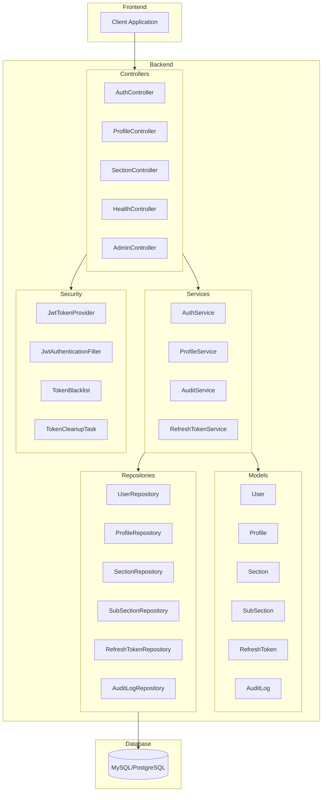
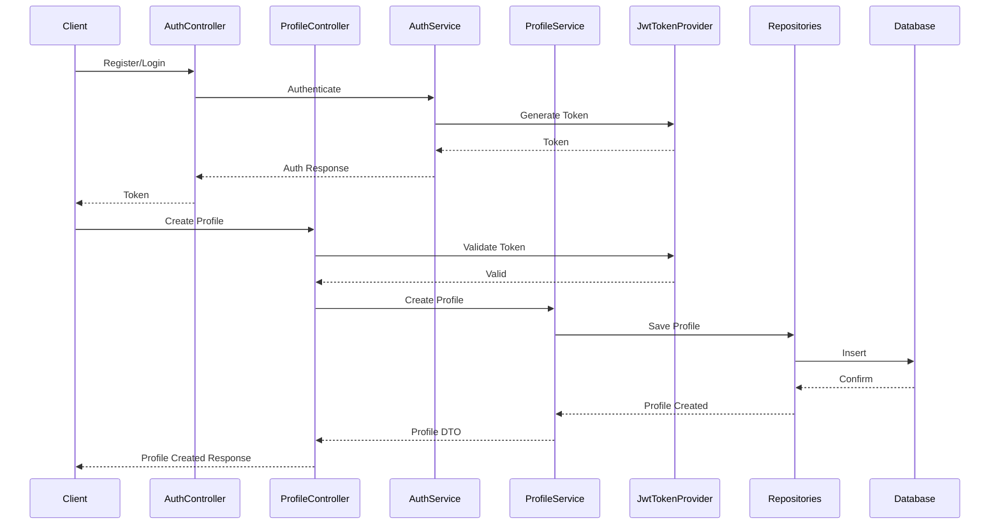
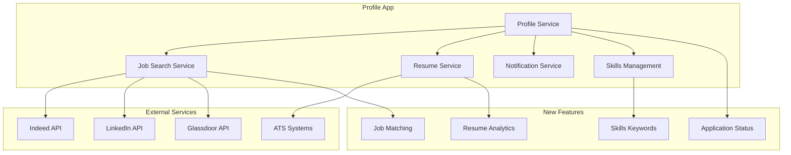
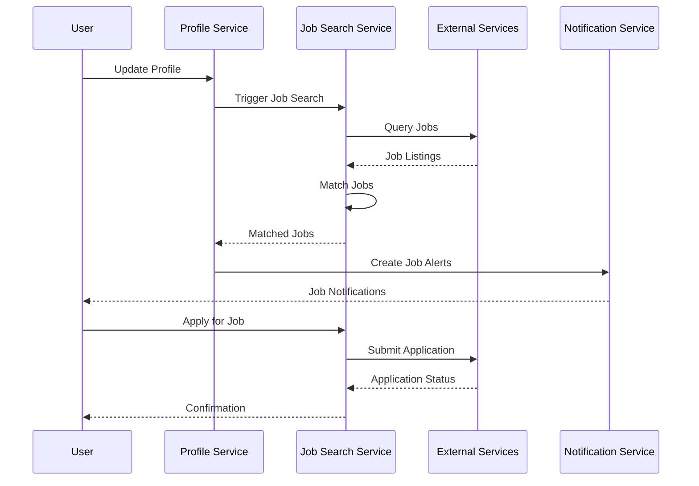
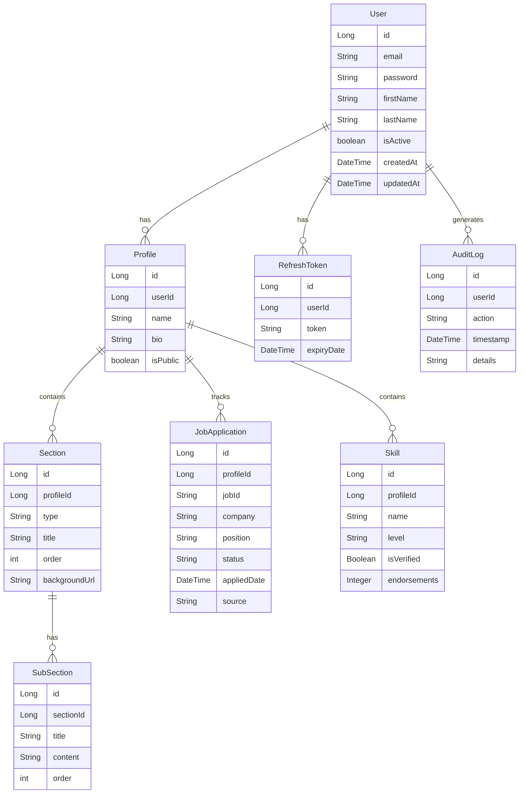

# Flexi Profile Application Overview

## 1. Introduction
The Flexi Profile application is a robust profile management system that allows users to create and manage their professional profiles. With the new job integration features, it evolves into a comprehensive career management platform that connects professionals with job opportunities.

## 2. Existing Architecture


### 2.1 Detailed Component Interactions


### 2.1 Existing Components
1. **Authentication & Authorization**
   - JWT-based authentication
   - Role-based access control
   - Token refresh mechanism
   - Token blacklisting

2. **Profile Management**
   - Profile creation and updates
   - Section management
   - Subsection organization
   - Public/Private visibility

3. **Audit & Security**
   - Action logging
   - Token cleanup
   - Admin controls

### 2.2 Existing API Endpoints

#### Authentication Endpoints
```
POST   /api/auth/register     - Register new user
POST   /api/auth/login        - User login
POST   /api/auth/refresh      - Refresh token
POST   /api/auth/logout       - User logout
GET    /api/auth/status       - Check auth status
```

#### Profile Endpoints
```
POST   /api/profiles          - Create profile
GET    /api/profiles/{id}     - Get profile
PUT    /api/profiles/{id}     - Update profile
DELETE /api/profiles/{id}     - Delete profile
GET    /api/profiles          - List all profiles
```

#### Section Endpoints
```
POST   /api/sections                    - Create section
GET    /api/sections/{id}               - Get section
PUT    /api/sections/{id}               - Update section
DELETE /api/sections/{id}               - Delete section
GET    /api/sections/profile/{id}       - Get profile sections
POST   /api/sections/reorder/{id}       - Reorder sections
```

#### Admin Endpoints
```
POST   /api/admin/tokens/revoke/{id}    - Revoke user tokens
GET    /api/admin/tokens/cleanup        - Cleanup expired tokens
POST   /api/admin/tokens/revoke-all     - Revoke all tokens
```

## 3. New Job Integration Architecture


### 3.1 Job Search Flow


### 3.1 New Components
1. **Job Search Integration**
   - Multi-platform job search
   - Intelligent job matching
   - Application tracking
   - Job recommendations

2. **Resume Management**
   - Resume parsing
   - Skills extraction
   - Format optimization
   - ATS compatibility check

3. **Skills Management**
   - Skills assessment
   - Endorsements
   - Gap analysis
   - Skill recommendations

4. **Notifications**
   - Job alerts
   - Application updates
   - Interview reminders
   - Profile optimization suggestions

### 3.2 New API Endpoints

#### Job Search Endpoints
```
GET    /api/jobs/search              - Search jobs across platforms
GET    /api/jobs/match               - Get matching jobs
POST   /api/jobs/preferences         - Set job preferences
GET    /api/jobs/recommendations     - Get job recommendations
```

#### Application Tracking Endpoints
```
POST   /api/applications             - Create application
GET    /api/applications/{id}        - Get application
PUT    /api/applications/{id}        - Update application
DELETE /api/applications/{id}        - Delete application
GET    /api/applications/status      - Get application status
```

#### Skills Management Endpoints
```
POST   /api/skills                   - Add skill
GET    /api/skills/{id}             - Get skill
PUT    /api/skills/{id}             - Update skill
DELETE /api/skills/{id}             - Delete skill
POST   /api/skills/endorse/{id}     - Endorse skill
GET    /api/skills/analysis         - Get skills analysis
```

#### Resume Management Endpoints
```
POST   /api/resume/parse            - Parse resume
GET    /api/resume/optimize         - Get optimization suggestions
POST   /api/resume/format           - Format resume
GET    /api/resume/ats-check        - Check ATS compatibility
```

## 4. Complete Entity Relationship Diagram


## 5. Implementation Steps

### Phase 1: Foundation
1. Set up new models
   - Create JobApplication entity
   - Create Skill entity
2. Create repositories
   - JobApplicationRepository
   - SkillRepository
3. Configure external API connections
   - Indeed API integration
   - LinkedIn API integration
   - Glassdoor API integration

### Phase 2: Core Services
4. Implement new services
   - JobSearchService
   - ResumeService
   - SkillsService
   - NotificationService
5. Develop controllers
   - JobController
   - ApplicationController
   - SkillController
   - ResumeController

### Phase 3: Features
6. Implement job matching algorithm
   - Skills matching
   - Experience matching
   - Location matching
   - Salary range matching
7. Develop resume features
   - Resume parsing
   - Format optimization
   - ATS compatibility checking
8. Set up notification system
   - Email notifications
   - In-app notifications
   - Job alerts

### Phase 4: Integration & Testing
9. Update existing services
   - Extend ProfileService
   - Enhance SecurityConfig
10. Write tests
    - Unit tests
    - Integration tests
    - E2E tests
11. Update documentation
    - API documentation
    - Integration guides
    - User guides

### Phase 5: Deployment
12. Deployment preparation
    - Environment configuration
    - Database migration
    - API key management
13. Monitoring setup
    - Performance monitoring
    - Error tracking
    - Usage analytics
